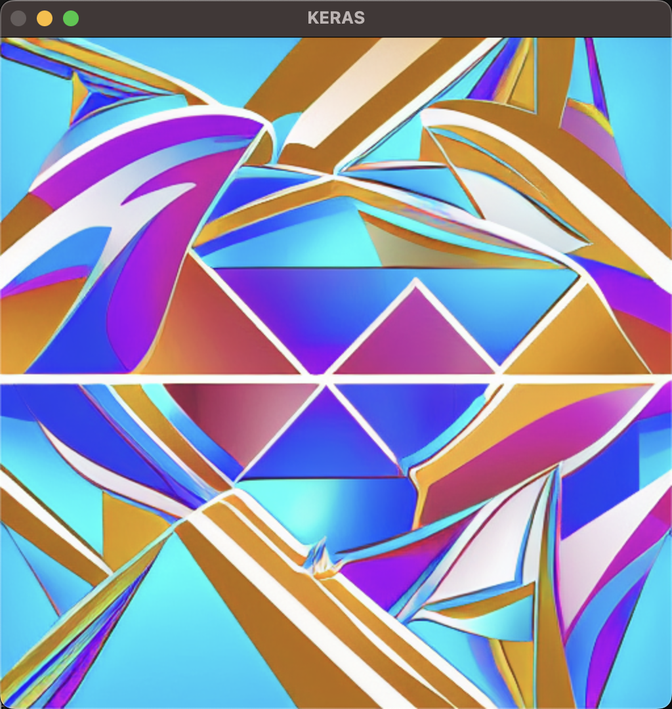

## Introduction

For this project, I created a Python script that uses a Stable Diffusion model to generate an image based on a hash string. I then used the generated image to cast a face in an input image. The script uses OpenCV to detect faces in an input image, and then uses a binary mask to replace the face with the generated image. The script also uses OpenCV to compute the perceptual hash of an input image.  

### Course Content

- **Week 05** Python Riddle
  - Keras text encoder to encode text for image generation
  - OpenCV image hash to calculate the image hash and use the hash as input text
- **Week 06** Image Processing
  - OpenCV cascade classifier to detect faces in an image
  - OpenCV adaptive threshold to create a binary mask
    - Gaussian for background
    - Mean for face
  - When the face is detected, reverse the color of mask, thus differentiate the face from the background and combine two masks
  - Iterate through pixels to apply the generated image to the picture according to adaptive threshold mask
    - White pixels in the mask are replaced with the generated image
    - Black pixels in the mask are replaced with the original image
- **Week 07 & 08** Neural Network
  - Stable Diffusion model to generate an image based on a hash string

## Ideas
As a crypto art content creator, I have always been interested the meaning of cryptology and cryptogram. As we know, NFT uses the SHA256 and file hash to check and validate the authenticity of the NFT.
This lead me think of what is the meaning of hash and encrypted information of digital contents. Is it just a mathematical calculation based on numerous bytes that seems so random, or these 'random' numbers can be the way how computers understand and memorize digital contents?
Random seed is very important in the process of generating random numbers in digital artworks, and the hash is the most common way to generate random numbers in programming language. 
Furthermore, identical random seed could lead to identical generative pattern, while the identical hash (or SHA code) of similar files can be used for computer to identify whether two files are the same.
So what happens if we use the hash of a file as the random seed to generate a new image? Will the new image be the same as the original file? Or will it be a completely different image? Could it be the artwork of a computer's understanding, memory or algorithm?  

Then I found that for Stable Diffusion model, if you input a series of random number, it could also generate image that looks quite fine. 

However, such result is not always satisfying as the result is not controllable, so I encode the image itself into text content and add additional text to regulate the generated image.  

The result looks much better not only by its own but also mask on the original image.  

After several trials, the final words that I used as input is  
**"modern pop art background for poster with large geometric pattern, concept art, tifo, "**  
which is give the most optimized result for me when masked on the original image.  
One can also add peom to the input text to make the result more interesting.

## Results

## NOTICE
- The program can intake any picture with/witout face, but the result is not guaranteed to be good.
- Please use a square image as input, and the output image will always be a 512x512 image.
- If you wish, please use `cv2.imwrite` to save the output image.

## Functions

`detect(filename, cascade_path)`: This function uses a Haar Cascade classifier to detect faces in an image specified by `filename`. It reads the image, converts it to grayscale, and then applies the classifier to detect faces. It then draws rectangles around the detected faces and displays the result using OpenCV.

`plot_images(images)`: This function takes a list of images as input and plots them using Matplotlib.

`generate_image(hash_string)`: This function generates an image based on a hash string passed as input using a Stable Diffusion model. The function first creates a text string by concatenating the input hash string with some other text, and then converts the text to an image using the model.

`get_adaptive_threshold(image)`: This function applies an adaptive threshold to an input image using OpenCV. It first converts the image to grayscale, then applies the threshold using a Gaussian filter.

`cast_image_with_mask(image, mask, generated)`: This function takes an input image, a binary mask, and a generated image as input. It then resizes the input image to 512x512 and replaces the pixels in the input image with those from the generated image wherever the mask is black. The resulting image is then displayed using OpenCV.

`get_hash_to_string(image)`: This function computes the perceptual hash of an input image using OpenCV. It first creates a PHash object, then computes the hash using the `compute` function. The hash is returned as a string.

The main part of the code is wrapped in a conditional statement that checks if the script is being run directly or imported as a module. If the script is being run directly, it loads an image, generates a hash string, generates a new image based on the hash string, creates a mask, and casts the input image with the generated image using the mask. The resulting image is then displayed using OpenCV.

## References
https://keras.io/api/keras_cv/models/stable_diffusion/  
https://github.com/CompVis/stable-diffusion
